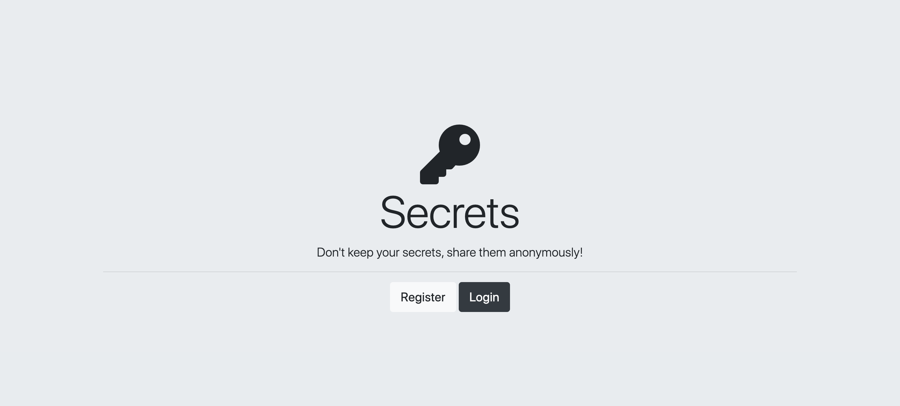
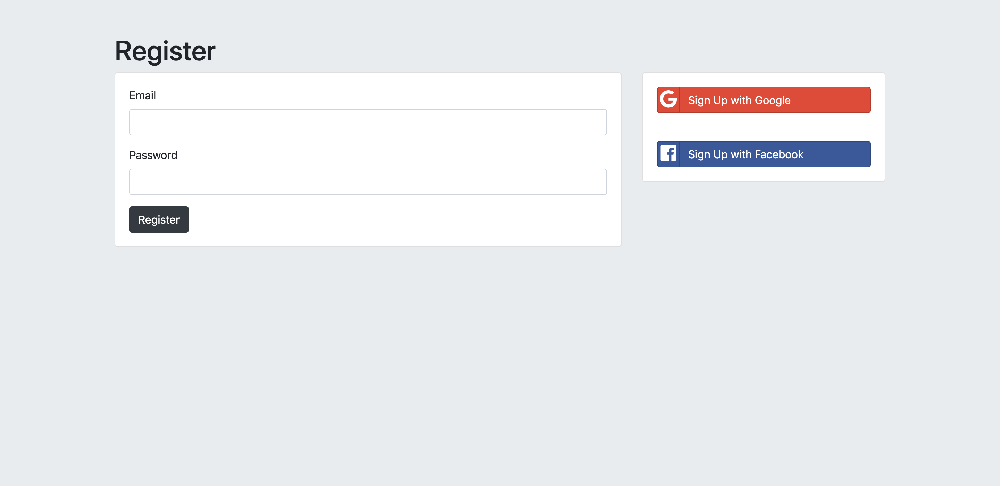
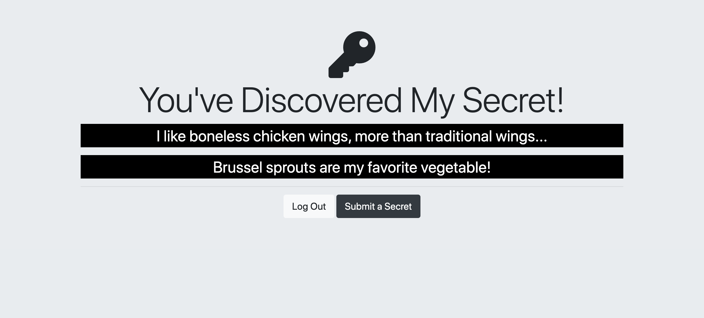
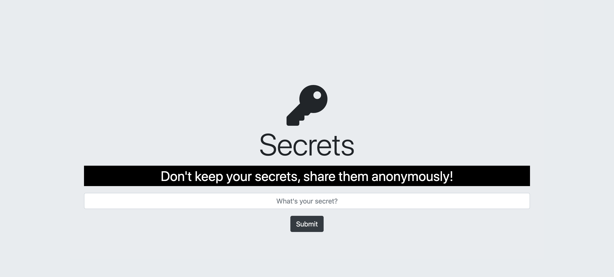

# Secrets App

The Secrets App is an anonymous social media app. User's are able to share a secret or a confession about themselves anonymously and it will be posted onto the collective dashboard for everyone to see. This app was created to apply my knowledge of security and authentication. The app uses hashing and salting to protect the user's login data and OAuth 2.0 if the user decides to register through a social media platform.

[LIVE DEMO](https://enigmatic-temple-07599.herokuapp.com/)

## Installation

After downloading the code, cd into the file location and run this in the terminal to get the app running locally.

```bash
Secrets $ node app.js
```
(Note: App will not run locally due to missing .env file needed to access the database. Please use the live demo.)

## Usage

To create an account click the register button.



From there, you can create an account through the app or register using either your Google or Facebook account.



After registering, you will be redirected to the Secrets dashboard where you can see everyone's secrets. To share your own secret, hit the "Submit a Secret" button.



Type in your secret in the text input and then hit "Submit". After that, you will be redirected to the dashboard where your secret and everyone else's secret is posted.



## Tech Stack
* HTML5
* CSS3
* JavaScript
* Node.JS
* MongoDB
* Passport
* OAuth 2.0

## Contributing
Pull requests are welcome. For major changes, please open an issue first to discuss what you would like to change.

Please make sure to update tests as appropriate.